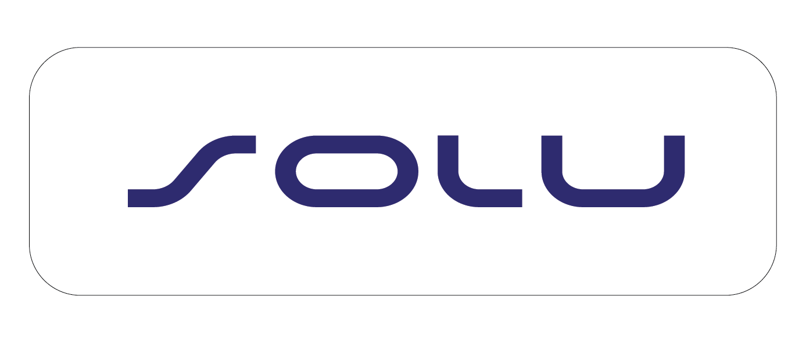

# [SOLU FILANTROPI TEKNOLOGI](https://solu.co.id/)

Hello 👋, We are Solu filantropi Teknologi.

We consist of young generation who have high integrity to build a better Indonesia through Information and Technology.

We're experienced in various types of Web Development projects and trusted by many ministries and government agencies to build solutions according to their needs.

## 🔭 Our Products

 - [Mobsen](https://mobsen.id/)
 - [Serelo Smart Office](https://solu.co.id/service/product/serelo)
 - [Lifetrace](https://solu.co.id/service/product/lifetrace)
 - [Serelock](https://solu.co.id/service/product/serelock)
 - [Amna](https://solu.co.id/service/product/amna)
 - [PiON](https://solu.co.id/service/product/pion)
 - [Delivery Management System](https://solu.co.id/service/product/delivery-management-system)

## 🤝 Our Services
 - [Education](https://solu.co.id/service/education)
 - [System Integration](https://solu.co.id/service/system-integration)
 - [IoT Solution](https://solu.co.id/service/iot-solution)
 - [Software Development](https://solu.co.id/service/software-development)
   
## 🚀 About Me

You can click [link](https://solu.co.id/about-us)

## Authors

[@devops-SOLU](https://www.github.com/devops-SOLU)

## Support

For support, email info@solu.co.id

